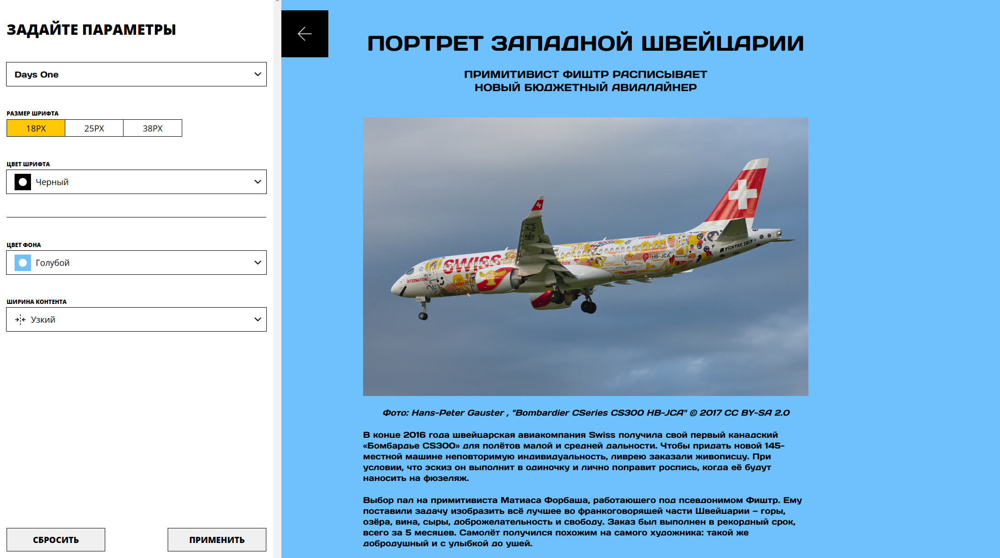

# React

## Функционал

- Реализовано всплывающее окно
- В нем мы можем поменять шрифт, размер, фон, size контента

### Инструкция по запуску

- Создайте папку для проекта и перейдите в неё.
- Склонируйте репозиторий `git clone git@github.com:AplusO1/blog-customizer.git`
- Установите зависимости `npm install`
- Запускайте проект `npm run start`

---
